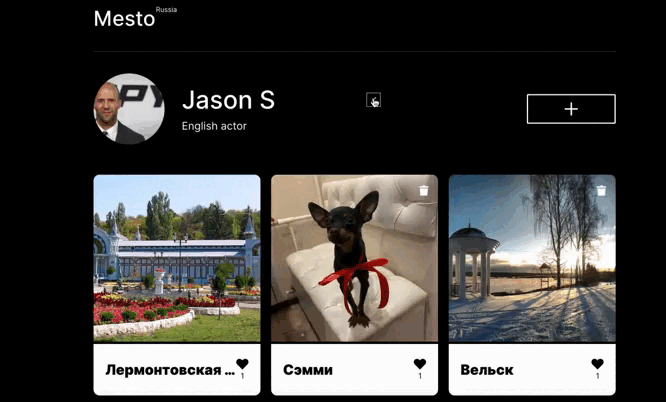
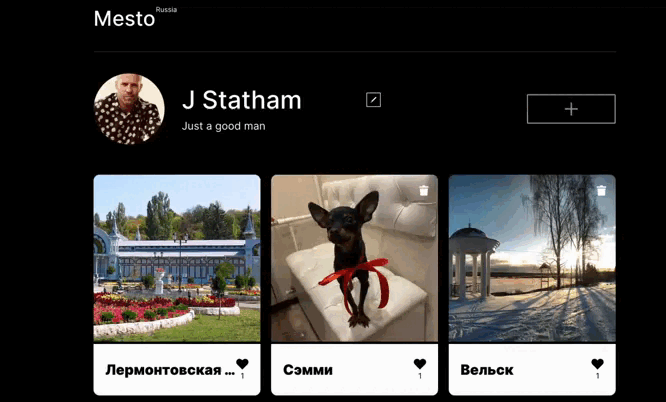

# Проект "Mesto"

Проект "Mesto" - это веб-приложение, которое позволяет пользователям делиться фотографиями своих любимых мест. Пользователи могут загружать изображения мест, которые они посетили или которые им нравятся, и просматривать фотографии других пользователей. Каждая фотография может быть оценена другими пользователями путем добавления лайка. У каждого пользователя есть свой профиль, где они могут изменить свои данные и загрузить собственное фото профиля.

## Установка

Для запуска проекта на локальной машине выполните следующие шаги:

1. Клонируйте репозиторий на свой компьютер:
```bash
git clone https://github.com/your_username/mesto-project.git
```
2. Перейдите в директорию проекта:
```bash
cd mesto-project
```
3. Установите зависимости:
```bash
npm install
```

## Использование

1. **Изменение профиля:** В разделе профиля пользователь может изменить свои данные, такие как имя и информацию о себе, а также загрузить новое фото профиля.
<div align="center">
  
</div>
<div align="center" id="loader" style="display: none;">
  
</div>

2. **Добавление нового места:** На главной странице пользователь может добавить новое место, указав название места и ссылку на фотографию.
<div align="center">
  
</div>
<div align="center" id="loader" style="display: none;">
  
</div>

3. **Лайки:** Пользователь может оценить фотографию другого пользователя, нажав на кнопку "Лайк".
<div align="center">
  
</div>
<div align="center" id="loader" style="display: none;">
  
</div>

## Доступ

На данный момент приложение доступно только для учеников практикума.

## Ссылка на репозиторий

https://github.com/astra463/mesto-project-ff.git
